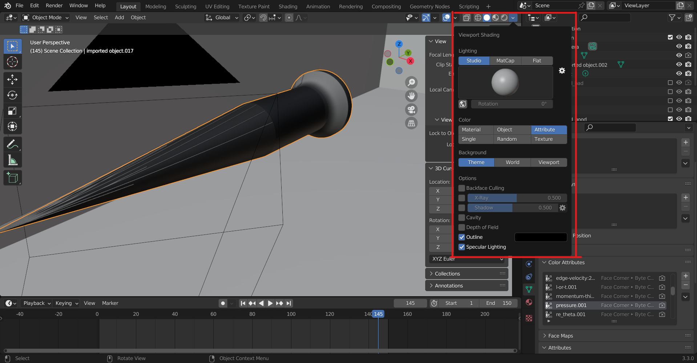
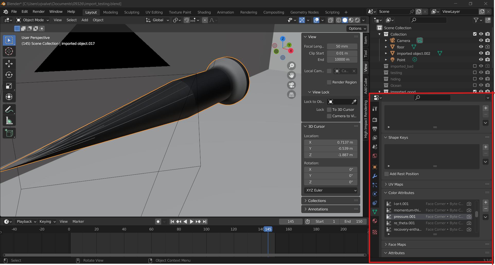
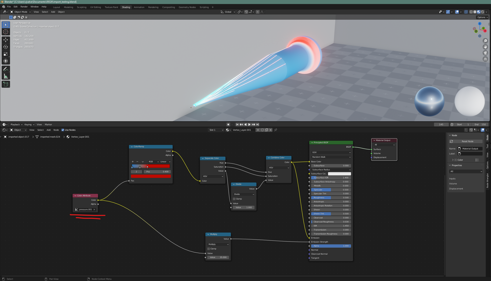

# readply - a Python extension module for fast(er) import of PLY files in Blender

The default PLY importer in Blender is quite slow when it comes to 
import large mesh files. Most Python-based importers suffer from this
because during import Python data structures are built up holding all 
geometry, vertex colors, etc. This simply takes quite a lot of time 
(and memory). 

Fortunately, Python objects that support the buffer protocol can be
passed in certain places of the Blender Python API.
We can use this functionality to pass chunks of memory containing
vertex and face data, without having to build up Python data
structures. We use NumPy arrays in the `readply` extension module 
to easily pass the data directly to Blender. 

Example usage:
```
$ blender [<scene.blend>] -P mesh_readply.py -- myfile.ply
```

Notes: 

- The `readply` module is not tied to Blender in any way and can 
  be used as a general PLY reader in Python.
- Compared to 2.7 the 2.8x version of Blender already improves on the
  import time in the example below. Memory usage in 2.8x also improved 
  substantially. But the speed improvement using this module is still 
  of the same order (roughly 6x). 
- There was a [Google Summer of Code 2019 project](https://devtalk.blender.org/t/gsoc-2019-fast-import-and-export/7343) for creating new
  faster Blender importers for PLY, STL and OBJ. The results unfortunately
  do not seem to be merged with mainline Blender at the moment.
  If that ever happens this module will probably become obsolete as
  far as its use in Blender is concerned.
- Development and testing is done on Linux, but the module should compile
  and work under different operating systems

## Performance

Below are some numbers when importing the Asian Dragon model [1] from 
The Stanford 3D Scanning Repository [2]. This 3D model consists of
3,609,600 vertices and 7,219,045 triangles.

With Blender 2.81 and `xyzrgb_dragon.ply` already in the filesystem cache:

```
# Native blender PLY importer (bpy.ops.import_mesh.ply())
$ blender -P test/blender_native_import.py -- xyzrgb_dragon.ply
total                           43.538 sec

# mesh_readply.py using readply extension module
$ blender -P mesh_readply.py -- xyzrgb_dragon.ply
reaply():                        0.631s
blender mesh+object creation:    5.226s
total                            5.857s
```

I.e. in this test the `mesh_readply.py` script (which uses the `readply`
module) loads the Dragon model 7.4x faster into Blender than 
Blender's own PLY import script.

1. http://graphics.stanford.edu/data/3Dscanrep/xyzrgb/xyzrgb_dragon.ply.gz
2. http://graphics.stanford.edu/data/3Dscanrep/

## Building

A `setup.py` script is provided to build the extension, either under
regular Python or with Blender's included version of Python. 

Note that for Blender usage it is advised to build and install the module using
Blender's Python version, as that will take care of placing the module
in the correct location.

### Blender

Note: the official Blender binaries do not include the Python headers. 
So you still need a full Python installation somewhere to build the 
`readply` extension.

#### Install Python headers and numpy for Blender on Linux

Build Open SSL 1.1.1 if not available on system (download openssl-1.1.1t.tar.gz)

```
% cd openssl-1.1.1t/
% ./config shared --prefix=<install prefix>/openssl-1.1.1t-install
% make ; make install
```

Build Python 3.10.10 (for Blender 3.4.1)

```
% ./configure --with-openssl=<install prefix>/openssl-1.1.1t-install/ --with-openssl-rpath=<install prefix>/openssl-1.1.1t-install/lib/ --prefix=<install prefix>/Python-3.10.10-install
```

Copy Python 3.10.10 install directory into Blender Python.

```
% cd blender-3.4.1-linux-x64/3.4/
% mv python/ python.orig
% cp -r <install prefix>/Python-3.10.10-install/ python/
```

Install numpy with pip3

```
% ./blender-3.4.1-linux-x64/3.4/python/bin/pip3 install numpy
```

Run the `setup.py` script with Blender's copy of
the Python interpreter. There should be a `python3.7m` executable in
your Blender directory. For example, for 2.81 on Linux the Python binary
is located at `<blender-dir>/2.81/python/bin/python3.7m`. Then run

```
$ <blender-dir>/2.81/python/bin/python3.7m setup.py install
```

If you get an error regarding the `setuptools` module not being found,
then run `.../python3.7m -m ensurepip` which should install the
`pip` module, followed by installing the `setuptools` module.

An alternative way is to run the setup script under Blender:

```
$ blender -b -P setup.py
```

### General Python

There's at least two options:

```
# Build the module, then copy it to the top-level directory
$ python setup.py build_ext --inplace
```

or

```
# Build the module, then copy it to the default Python module location
# (which might be a system-wide directory)
$ python setup.py install
```

## Notes

- Make sure that the version of NumPy used for compiling the readply
  extension has the same API version as the one that is used by Blender
  (the official binary distributions of Blender include a version of NumPy)
- The `readply` extension module can be compiled for both Python 2.x and 3.x,
  even though Blender uses Python 3.x
- Texture coordinates may be stored in s+t or u+v vertex fields, depending
  on what property names the PLY file being read uses

### *Additions*
- Can now also import .ply file that has additonal vertex attributes associated with them
  ```
  ply
  format ascii 1.0
  comment VTK generated PLY File
  obj_info vtkPolyData points and polygons: vtk4.0
  element vertex 17023
  property float x
  property float y
  property float z
  property float edge-j
  property float edge-line-height
  property float edge-mach
  property float edge-pressure
  property float edge-speed
  property float edge-velocity:0
  property float edge-velocity:1
  property float edge-velocity:2
  property float l-or-t
  property float momentum-thickness
  property float pressure
  property float re_theta
  property float recovery-enthalpy
  property float shock-j
  property float shock-line-height
  property float wall-c_f
  property float wall-c_h
  property float wall-c_p
  property float wall-friction-velocity
  property float wall-heat-flux
  property float wall-tau-mag
  property float wall-y_plus
  property float Points:0
  property float Points:1
  property float Points:2
  ```
- Values will be stored both as part of the object's vertex layers with the raw data and as vertex color attributes that take the max and min of each property and assign a lerped interpolation value in black in white using RGBA color space ([0, 0, 0, 1] = black, [1, 1, 1, 1] = white)
  

## Bugs

- The module is currently not usable as a drop-in replacement of the
  built-in PLY import in Blender
- It is assumed that if the PLY file includes vertex coordinates they 
  are defined in x, y and z order (the PLY header allows properties in any order).
  
## Author

Paul Melis (paul.melis@surfsara.nl), SURFsara Visualization group

The files under the `rply/` directory are a copy of the RPly 1.1.4 
source distribution (see http://w3.impa.br/~diego/software/rply/).

### Additions

Victor Valverde (vjvalve@sandia.gov), ORG 02491


## License

See the `LICENSE` file in the root directory of this distribution,
which applies to all files except the ones in the `rply/` directory.

See `rply/LICENSE` for the the license of the RPly sources.

---

# paraview_ply_exporter - python code to export out a paraview model with all the additional vertex properties

Paraview's .ply export is currently broken in so far that it can't properly export out a .ply file with all the vertex attributes associated with it. This script is a command line executable that uses Paraview's pvbatch.exe to export the file as a .ply along with the additional vertex properties as CSVs. If the merge flag is marked it will then merge a .ply file and the vertex attributes into a single new .ply file.

The script does require the use of pvbatch so that it has access to Paraviews local libraries that allows for filter application and extractors.

## Example usage:
```
C:\Program/ Files\ParaView/ 5.10.1\bin/pvbatch.exe paraview_ply_exporter.py -f C:\Users\user\Documents surface_data.exo.16.00 -e -m -o default_reflect
```

## Notes:
- Can use `paraview_ply_exporter` to export out .ply file and csv extractors using only the -e flag.
  - Files will be exported into the same directory as the location of the paraview file specified under an `ExtractorOutput` folder
- Can use `paraview_ply_exporter` to only merge the files if the -m flag is marked but does require the files to be merged to be in an `ExtractorOutput` folder
  - Also, you must use the name of the original file being merged
  - > Example: 
    ```
    C:\Program/ Files\ParaView/ 5.10.1\bin/pvbatch.exe paraview_ply_exporter.py -f C:\Users\user\Documents\surface_data.exo.16.00 -m
    ```
    > Requires `surface_data.ply`, `surface_data_celldata.csv`, and `surface_data_pointdata.csv` to exist in `ExtractorOutput` (`ExtractorOutput` must be in the same directory as `surface_data.exo.16.00` )

## Author

Victor Valverde (vjvalve@sandia.gov), ORG 02491

---

# HighImpactRenderingAddOn - Blender addon for importing a .ply file with multiple vertex properties using modified `readply.c` script 

The addon will create a `HighImpactRendering` panel located on the VIEW_3D viewport under the UI region_type. The user can either type out the file path of the .ply file they'd like to import or click the button with next to the text space to search for the file. Do **NOT** use the standard Blender importer found under File-> Import -> Stanford (.ply); this uses Blender's native importer which is much slower and doesn't apply the vertex properties as vertex attributes. Once imported vertex properties are applied as vertex_layers of the object and vertex color attributes along a lerped black to white scale (original values are maintained in the object's vertex_layers but each vertex value is linearly interpolated between the min [black] and max [white] value of the property).

## Import
* Open Blender preferences under `Edit->Preferences->Add-ons` and click the install button. Locate `HighImpactRenderingAddOn.zip` and install the add-on


## Notes
- User can observe the vertex color attributes of an object while in the solid rendering mode (default) by going to the viewport shading panel (located in the top right of the VIEW_3D viewport) and setting the color type to `attribute` 
  - User can then obeserve the desired property by selecting the attribute in the color attributes panel of the object's `object data properties` 
- User can then use color attribute data to apply to shader in whichever way they want.
  - **NOTE**: this only works in cycles or eevee rendering engine.
  - Example: 
  - Separating the HSV of the color isn't necessary but the value does effect the emission strength of the material so that is an additonal feature that can be tweaked to floor or ceil all the colors elected.
  - Multiply node is another parameter to tweak the emission strength of the material.

## Author

Victor Valverde (vjvalve@sandia.gov), ORG 02491
